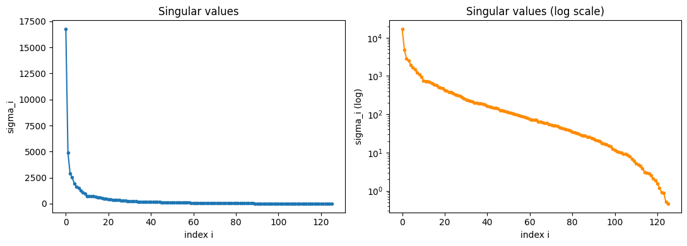
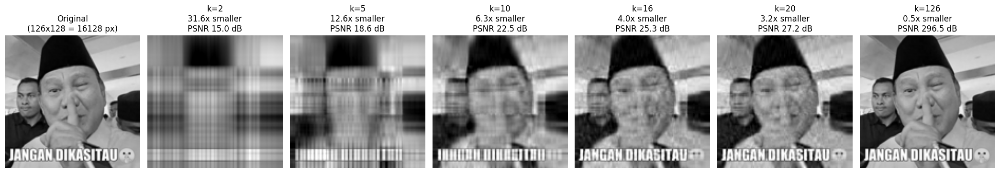

# SVD Image Compression, Built From Scratch

This repo explains `svd_image_compression.ipynb`, a notebook that derives and
implements the Singular Value Decomposition (SVD) **without calling any
library eigensolver or SVD routine** (no `np.linalg.svd`, no `np.linalg.eig`),
and uses that decomposition to compress and decompress an image.

## Overview

The notebook has one goal: take an image, treat it as a numerical matrix, and
show that most of its information lives in a handful of dominant directions.
Compression exploits this by keeping only those directions.

The pipeline:

1. Implement the **Jacobi eigenvalue algorithm** for symmetric matrices, entirely from elementary matrix operations.
2. Use it to eigendecompose `AᵀA`, and from that build the full SVD `A = UΣVᵀ`.
3. Load an image and run our from-scratch SVD on its pixel matrix.
4. **Compress**: truncate to the top-`k` singular triplets.
5. **Decompress**: multiply the truncated factors back together.
6. Measure quality (PSNR) and storage savings (compression ratio) across a range of `k`.

## Introduction to Linear Algebra

A fast refresher on the linear algebra behind SVD. Skip ahead to
[How SVD Works](#how-svd-works) if you're already comfortable with
vectors, matrices, and eigenvectors.

**Vectors and matrices.** A vector `x ∈ ℝⁿ` is an ordered list of `n` real
numbers — a point (or arrow) in n-dimensional space. A matrix `A ∈ ℝ^(m×n)`
is a rectangular array of numbers with `m` rows and `n` columns. In this
project, a grayscale image *is* a matrix: `A[i,j]` is the brightness of
the pixel at row `i`, column `j`.

The key operation is matrix-vector multiplication `Ax`: it takes a vector
in `ℝⁿ` and produces one in `ℝᵐ`. This map is *linear* —
`A(αx + βy) = αAx + βAy` — so every matrix can be thought of as a linear
transformation: a way of stretching, rotating, and reflecting space.

**Length, angle, and orthogonality.** The norm (length) of a vector is
`‖x‖₂ = √(xᵀx)`. The inner product `xᵀy = Σᵢ xᵢyᵢ` measures how aligned
two vectors are; they're **orthogonal** if `xᵀy = 0`. A set of vectors is
**orthonormal** if mutually orthogonal and unit length. A square matrix
`Q` with orthonormal columns is an **orthogonal matrix**, satisfying
`QᵀQ = QQᵀ = I`. Multiplying by an orthogonal matrix is a rotation and/or
reflection — it changes direction but never length, since
`‖Qx‖₂² = xᵀQᵀQx = xᵀx = ‖x‖₂²`. Orthogonal matrices are exactly what `U`
and `V` are in the SVD.

**Eigenvalues and eigenvectors.** For a square matrix `S`, a nonzero
vector `v` is an eigenvector with eigenvalue `λ` if `Sv = λv` — `v` is a
special direction that `S` only stretches (by factor `λ`) rather than
rotates. Collecting `n` such eigenvectors into a matrix `V` and their
eigenvalues into a diagonal matrix `Λ` gives the eigendecomposition
`S = VΛV⁻¹` (when `V` is invertible).

**Spectral theorem.** If `S` is real and **symmetric** (`S = Sᵀ`), its
eigenvectors can always be chosen real and orthonormal, so `V⁻¹ = Vᵀ` and
`S = VΛVᵀ`. This is the single most important fact this project relies
on: it turns "decompose a symmetric matrix" into "find an orthogonal
matrix `V` and diagonal matrix `Λ`" — exactly what the Jacobi algorithm
computes.
*Source page: Goodfellow, Bengio, and Courville, Deep Learning (MIT Press, 2016), Section 2.7, pp. 40–43.*

**Why SVD needs more than eigendecomposition.** Eigendecomposition only
applies to square, symmetric matrices. An image is generally rectangular
(`m ≠ n`), and even square images aren't symmetric. SVD generalizes
eigendecomposition to *any* matrix by using two orthogonal matrices (`U`
and `V`) instead of one, applying eigendecomposition not to `A` itself
but to the symmetric matrix `AᵀA` built from it.

## How SVD Works

**The geometric picture.** Every matrix `A`, regardless of shape, can be
understood as three steps applied in sequence:

1. **Rotate** (by `Vᵀ`): reorient the input space's axes.
2. **Scale** (by `Σ`): stretch or shrink along each axis by `σᵢ`, possibly changing dimension.
3. **Rotate** (by `U`): reorient into the output space.

Concretely, `Ax = U(Σ(Vᵀx))`: `Vᵀ` rotates `x`, `Σ` scales each
coordinate independently, then `U` rotates the result. A unit circle (or
sphere) fed through `A` always comes out as an ellipse (or ellipsoid) —
the `σᵢ` are exactly the lengths of that ellipse's axes, and `vᵢ`/`uᵢ`
are the axis directions before/after the transformation. Large `σᵢ` means
`A` stretches that direction a lot (a lot of "energy"); small `σᵢ` means
that direction barely matters.

**Why this helps compress an image.** Treat the image matrix `A` as data
rather than a transformation. Writing `A = Σᵢ σᵢ uᵢvᵢᵀ` expresses the
image as a weighted sum of simple rank-1 "template" images `uᵢvᵢᵀ`,
ordered from most to least important by `σᵢ`. Natural images are highly
structured (smooth gradients, repeated edges, correlated rows/columns),
so only a handful of these templates are needed to reconstruct something
visually close to the original — exactly what the comparison image above
demonstrates: even `k=16` out of 126 possible terms already produces a
recognizable image.

**The three ideas this project chains together:**

1. **Spectral theorem** — any symmetric matrix diagonalizes with an orthogonal eigenvector matrix.
2. **`AᵀA` is symmetric** for *any* `A`, so the spectral theorem applies even when `A` itself is rectangular or asymmetric.
3. **Eckart–Young–Mirsky** — truncating that decomposition to its largest terms gives the best possible low-rank summary, in a precise, provable sense.

Together these three ideas are the entire mathematical content of this
project; everything below is turning them into working code.

## Math Background

**SVD.** For any real matrix `A ∈ ℝ^(m×n)`, there exist orthogonal matrices
`U ∈ ℝ^(m×m)`, `V ∈ ℝ^(n×n)`, and a diagonal matrix `Σ ∈ ℝ^(m×n)` with
non-negative entries `σ₁ ≥ σ₂ ≥ ... ≥ 0` such that `A = UΣVᵀ`, equivalently
written as a sum of rank-1 matrices `A = Σᵢ σᵢ uᵢ vᵢᵀ`.
*Source page: Goodfellow, Bengio, and Courville, Deep Learning (MIT Press, 2016), Section 2.8, p. 44.*

**Eckart–Young–Mirsky theorem.** Among all matrices of rank ≤ k, the
truncated SVD `Aₖ = Σᵢ₌₁ᵏ σᵢ uᵢ vᵢᵀ` is the *best possible* rank-k
approximation of `A` in both Frobenius and spectral norm. This is why
truncating the SVD is not just *a* way to compress an image — it's provably
*optimal*.
*Source page: connection discussed via PCA in Goodfellow, Bengio, and Courville, Deep Learning (MIT Press, 2016), Section 2.12, pp. 48–51.*

**From eigendecomposition to SVD.** `AᵀA` is symmetric positive
semi-definite, and `AᵀA = V(ΣᵀΣ)Vᵀ`. So:
- the eigenvectors of `AᵀA` are the right singular vectors `V`
- the singular values are `σᵢ = √λᵢ`
- the left singular vectors follow from `uᵢ = (1/σᵢ) A vᵢ`

To keep the eigendecomposition cheap, we diagonalize whichever of `AᵀA`
(n×n) or `AAᵀ` (m×m) is smaller.
*Source page: Goodfellow, Bengio, and Courville, Deep Learning (MIT Press, 2016), Section 2.7, p. 42, and Section 2.8, pp. 44–45.*

**Jacobi eigenvalue algorithm.** A 1846 method for eigendecomposing a
symmetric matrix using only Givens rotations. Each rotation zeroes one
off-diagonal entry; repeated cyclic sweeps over all pairs `(p, q)` drive the
off-diagonal energy to zero, leaving a diagonal matrix of eigenvalues and an
accumulated orthogonal matrix of eigenvectors. It's numerically stable and
converges quadratically once off-diagonal entries are small.

**Truncation & compression.** Keeping only the top `k` singular triplets:
- storage cost drops from `mn` to `k(m + n + 1)` numbers
- compression ratio = `mn / (k(m + n + 1))`
- quality is measured with PSNR: `20·log₁₀(255) − 10·log₁₀(MSE)`
- energy retained by the top `k` values: `Σᵢ₌₁ᵏ σᵢ² / Σᵢ₌₁ʳ σᵢ²`

## Code Walkthrough

### `jacobi_eigenvalue(S, tol=1e-10, max_sweeps=100)`

Implements the cyclic Jacobi algorithm directly: computes a rotation angle
for each off-diagonal pair, applies paired row/column rotations, accumulates
them into `V`, and stops once the off-diagonal energy falls below `tol`.

```python
def jacobi_eigenvalue(S, tol=1e-10, max_sweeps=100):
    A = S.copy().astype(np.float64)
    n = A.shape[0]
    V = np.eye(n)

    for sweep in range(max_sweeps):
        off_diag_energy = np.sqrt(2.0 * np.sum(np.triu(A, 1) ** 2))
        if off_diag_energy < tol:
            break

        for p in range(n - 1):
            for q in range(p + 1, n):
                apq = A[p, q]
                if abs(apq) < 1e-14:
                    continue

                app, aqq = A[p, p], A[q, q]
                if abs(app - aqq) < 1e-14:
                    theta = np.pi / 4.0 if apq > 0 else -np.pi / 4.0
                else:
                    theta = 0.5 * np.arctan2(2.0 * apq, app - aqq)

                c, s = np.cos(theta), np.sin(theta)

                row_p, row_q = A[p, :].copy(), A[q, :].copy()
                A[p, :] = c * row_p + s * row_q
                A[q, :] = -s * row_p + c * row_q

                col_p, col_q = A[:, p].copy(), A[:, q].copy()
                A[:, p] = c * col_p + s * col_q
                A[:, q] = -s * col_p + c * col_q

                vcol_p, vcol_q = V[:, p].copy(), V[:, q].copy()
                V[:, p] = c * vcol_p + s * vcol_q
                V[:, q] = -s * vcol_p + c * vcol_q

    eigvals = np.diag(A).copy()
    return eigvals, V
```

### `svd_from_scratch(A)`

Builds the full SVD by eigendecomposing whichever Gram matrix is smaller,
then recovering the remaining factor via `u = Av/σ` or `v = Aᵀu/σ`.

```python
def svd_from_scratch(A, verbose=False):
    A = A.astype(np.float64)
    m, n = A.shape
    r = min(m, n)

    if n <= m:
        AtA = A.T @ A
        eigvals, V = jacobi_eigenvalue(AtA)
        order = np.argsort(eigvals)[::-1]
        eigvals, V = eigvals[order], V[:, order]
        eigvals = np.clip(eigvals[:r], 0, None)
        sigma = np.sqrt(eigvals)
        V = V[:, :r]

        U = np.zeros((m, r))
        for i in range(r):
            if sigma[i] > 1e-10:
                U[:, i] = (A @ V[:, i]) / sigma[i]
            else:
                U[:, i] = 0.0
    else:
        AAt = A @ A.T
        eigvals, U = jacobi_eigenvalue(AAt)
        order = np.argsort(eigvals)[::-1]
        eigvals, U = eigvals[order], U[:, order]
        eigvals = np.clip(eigvals[:r], 0, None)
        sigma = np.sqrt(eigvals)
        U = U[:, :r]

        V = np.zeros((n, r))
        for i in range(r):
            if sigma[i] > 1e-10:
                V[:, i] = (A.T @ U[:, i]) / sigma[i]
            else:
                V[:, i] = 0.0

    return U, sigma, V.T
```

Eigenvalues are sorted descending to enforce `σ₁ ≥ σ₂ ≥ ...`; singular
values near zero are clipped to avoid division by zero for rank-deficient
matrices.

### Compression / decompression / quality metrics

```python
def compress(U, S, Vt, k):
    return U[:, :k].copy(), S[:k].copy(), Vt[:k, :].copy()

def decompress(Uk, Sk, Vtk):
    return Uk @ np.diag(Sk) @ Vtk

def compression_ratio(m, n, k):
    original = m * n
    compressed = k * (m + n + 1)
    return original / compressed

def psnr(original, reconstructed, max_val=255.0):
    mse = np.mean((original - reconstructed) ** 2)
    if mse == 0:
        return float('inf')
    return 20 * np.log10(max_val) - 10 * np.log10(mse)
```

### Choosing `k` via cumulative energy

```python
energy = np.cumsum(S**2) / np.sum(S**2)
k90 = np.searchsorted(energy, 0.90) + 1   # smallest k retaining ≥90% energy
k99 = np.searchsorted(energy, 0.99) + 1   # smallest k retaining ≥99% energy
```

### Color images

Each RGB channel gets its own from-scratch SVD and its own optimal rank-`k`
approximation, then the channels are re-stacked:

```python
def compress_color_image(rgb_array, k):
    channels = []
    for c in range(3):
        Uc, Sc, Vtc = svd_from_scratch(rgb_array[:, :, c])
        Uk, Sk, Vtk = compress(Uc, Sc, Vtc, k)
        channels.append(decompress(Uk, Sk, Vtk))
    out = np.clip(np.stack(channels, axis=-1), 0, 255)
    return out.astype(np.uint8)
```

## Results

Running the pipeline on a 126×128 test image gives the singular value
spectrum below — it decays fast, so most of the image's energy sits in the
first handful of directions.



Rank needed to capture 90% of energy: k = 2 / 126
Rank needed to capture 99% of energy: k = 16 / 126

Reconstructing the image at several values of `k` shows the trade-off
between compression ratio and quality:



| k   | compression ratio | PSNR (dB) |
|-----|--------------------|-----------|
| 2   | 31.62x             | 15.04     |
| 5   | 12.65x             | 18.57     |
| 10  | 6.32x              | 22.47     |
| 16  | 3.95x              | 25.34     |
| 20  | 3.16x              | 27.20     |
| 126 | 0.50x              | 296.53    |

At `k=126` (full rank for this image) reconstruction is exact up to
floating-point error, but storage is now *larger* than the original —
the compression ratio drops below 1x, reflecting the crossover point in
the storage-cost formula above.

## Notebook Structure (Cell-by-Cell)

1. **Imports** — `numpy`, `matplotlib`, `PIL`; deliberately no `scipy.linalg` or `numpy.linalg` decomposition routines.
2. **`jacobi_eigenvalue`** — the from-scratch eigendecomposition.
3. **Sanity check** on a random symmetric matrix `S = MMᵀ`: verifies reconstruction and orthogonality of `V`.
4. **`svd_from_scratch`** — builds the full SVD.
5. **Sanity check** on a random non-square matrix: verifies reconstruction error and orthogonality of `U`.
6. **Load image** — reads a user image or falls back to a synthetic test pattern; resizes to keep the `O(n³)`-per-sweep Jacobi method tractable.
7. **Run SVD** on the image matrix; reports timing and full-rank reconstruction error (should be ≈0).
8. **Singular value spectrum** — linear and log-scale plots of `σᵢ`; computes `k90`, `k99`.
9. **`compress` / `decompress` / `compression_ratio` / `psnr`**.
10. **Multi-`k` comparison** — reconstructs the image at several ranks, displays compression ratio + PSNR side by side.
11. **On-disk savings** — writes the truncated factors to `.npz` and compares file size against the raw array.
12. **Color-image extension**.

## Why This Works

- An image matrix's rows/columns are typically highly correlated (smooth regions, repeated textures, symmetric structure), so most of its "shape" is captured by a small number of dominant singular directions.
- Eckart–Young–Mirsky guarantees truncated SVD is the *provably optimal* low-rank approximation under squared error.
- The Jacobi method uses only rotations — numerically stable, orthogonality-preserving elementary operations — which is why it was chosen for a "from scratch" implementation.
- Compression ratio grows as `k` shrinks, while PSNR degrades — the classic rate–distortion trade-off, tunable via a single integer `k`.

## Practical Notes and Limitations

- **Complexity.** Each Jacobi sweep costs `O(n³)`, and multiple sweeps are needed for convergence — far slower than LAPACK's `dgesvd`/`dgesdd` (used internally by `np.linalg.svd`), which is why the notebook keeps images small (e.g. 128×128).
- **Numerical stability.** `AᵀA` squares the condition number of `A`, so computing SVD this way is less robust than direct bidiagonalization-based algorithms for ill-conditioned matrices — entirely adequate for 8-bit image data.
- **Rank-deficiency.** Singular values below `1e-10` are treated as zero to avoid division-by-zero when recovering `uᵢ`.
- **Production use.** This implementation is for pedagogical transparency. For real workloads, always prefer `np.linalg.svd` (or a randomized SVD for very large matrices).

## Reference

I. Goodfellow, Y. Bengio, and A. Courville, *Deep Learning*. Cambridge, MA:
MIT Press, 2016.
- Section 2.7, "Eigendecomposition," p. 42.
- Section 2.8, "Singular Value Decomposition," pp. 44–45.
- Section 2.12, "Example: Principal Components Analysis," pp. 48–51.
